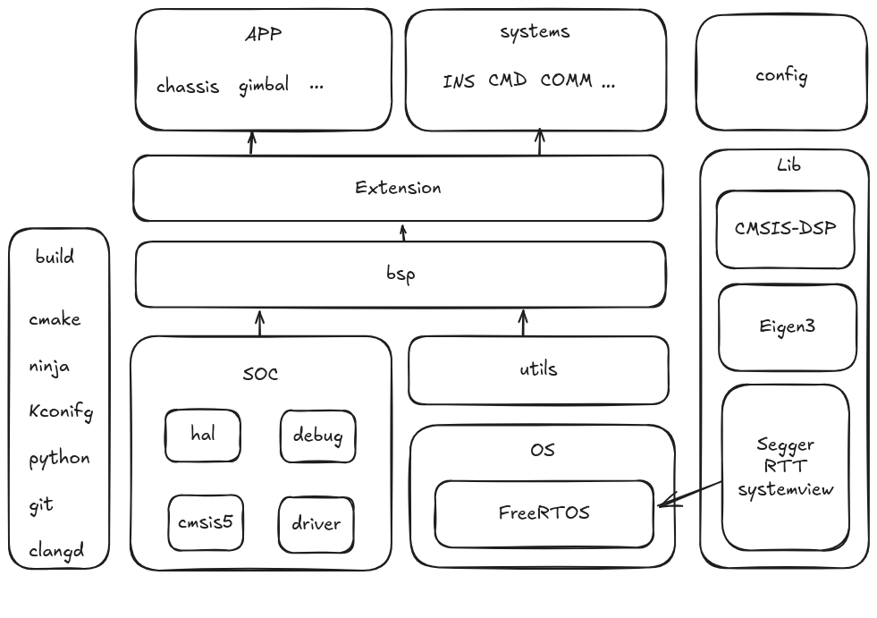

# PinyCore
<p align="center">
    <a href="http://commitizen.github.io/cz-cli/"></a>
    <a href="https://github.com/semantic-release/semantic-release"></a>
</p>

目前本仓库不会实现任何具体兵种，只会提供一个基础框架, 只有通用的代码需要pr到本仓库, 当app层模块稳定实现且兼容所有代码或特定时期（如完整形态考核等）才需要pr到本仓库，其他需要自己实现的地方：

1. app层
2. cmd输入的逻辑配置

# 🎯Requirements

1. cmake >= 3.24
2. ninja >= 1.1
3. [arm-none-eabi-toolchains](https://developer.arm.com/downloads/-/arm-gnu-toolchain-downloads) >= 10.3.1 or [llvm](https://github.com/arm/arm-toolchain) (experimental)
4. python >= 3.2
5. [kconfiglib](https://github.com/ulfalizer/Kconfiglib)

we also suggest to install following software:
1. [clangd](https://clangd.llvm.org/) >= 20.0
1. clang-format >= 20.0
2. [commitizen](https://github.com/commitizen/cz-cli)

# 🌟Getting started
## 🏗️Build

```sh
cmake -B build -G Ninja
ninja -C build
```

### menuconfig

```sh
cmake --build ./build --target menuconfig
```

## 🐞Debug

1. openocd >= 0.12.0
2. [cortex-debug](https://github.com/Marus/cortex-debug) / [codelldb](https://github.com/vadimcn/codelldb) (vscode-plugin)
3. Ozone 3.24
4. systemview

## 📝Note

1. 全局变量构造不要有 hal 库的操作，但可以初始化 hal 指针，因为 hal 是在 main 中初始化，而全局变量是在 main 之前构造!

## 与旧框架对比

### 为什么要更换到 arm-none-eabi-toolchains (而不是选择某些商业软件)?
1. 开源。使用开源软件的好处（免费，可以得到社区的帮助，可以结合github ci action...)
2. 支持不同系统linux/win
3. 可以使用更多工具。如：
    1. cmake 帮助快速构建，而不是像某商业软件单独选择文件编译，cmake还可以结合别的工具，快速链接第三方依赖，可生成compile_commands.json，结合 lsp clangd实现代码跳转，代码格式化...)
    2. ninja 可以多核编译，而某商业软件是单核编译
    3. kconfig 借鉴了 linux 的选择编译，通过结合 cmake 和 py 实现动态选择编译
    4. openocd + cortex-debug 帮助对代码进行调试

### 为什么使用 c/c++?
1. c++ 标准库提供了大量脚手架可以直接使用，避免了重复造轮子（虽然在嵌入式中有不少的坑）
2. 为了支持 c++ 的第三方库，如 eigen3, TinyMPC 等...
3. 可以使用一些 c++ 的设计模式，构建清晰易读的代码
4. 零成本抽象

### 为什么加入 RTOS?
1. 线程安全。旧框架裸机开发，自求多福,其中充满大量数据竞争的变量。而本框架较为注重这方面的设计，特别是在中断处理中加入防止数据竞争的设计
3. 使用 FreeRTOS 是因为其有较全的文档，并且易于上手
3. FreeRTOS 实现了各种通信机制，以及任务处理，可以快速构建代码，避免重复造轮子
4. 结合 systemview 可以清晰了解系统运行状况

### 更完整的项目流程
1. 使用 git hook 本地检查，并加入 github action。实现代码格式化和编译检查
2. 使用 pr 处理提交。集思广益，不再是一个人一个键盘写一个队的代码
3. 版本管理。通过 github action 自动发布版本

### 更多的新设计
1. log 日志系统。旧框架需要通过串口+vofa查看日志，而现在依赖RTT 只需要调试接口即可实现日志输出
2. Soc 层。旧框架需要分仓库支持不同的板子，而现在通过 Soc + Bsp 抽象，上层可以直接使用抽象接口，尽可能不需要了解底层硬件
3. kconfig。旧框架使用宏去选择编译。新框架加入kconfig，可以图形化选择功能，并且不会产生git diff。其动态选择更加灵活，结合 cmake 可以实现真正的选择编译。
4. hardfault 处理。参考 [hardfault](https://kb.segger.com/Cortex-M_Fault)
5. FSM。旧框架充斥大量嵌套if/else, 阅读理解成本极高。使用 FSM 可以更人性化直观理解机器人运行状态，更方便处理状态转换

### 更清晰的架构



# 🙌Contributing

Contributions are always welcome!

See [CONTRIBUTING](./.docs/CONTRIBUTING.md) for ways to get started.

Please adhere to this project's [CODE_OF_CONDUCT](./.docs/CODE_OF_CONDUCT.md).

> [!IMPORTANT]
> PinyCore is still in early development, and is not yet complete. It should be stable enough and we have
> been daily driving it for quite a while, but expect some bugs and possibly breaking changes to the
> config file.
