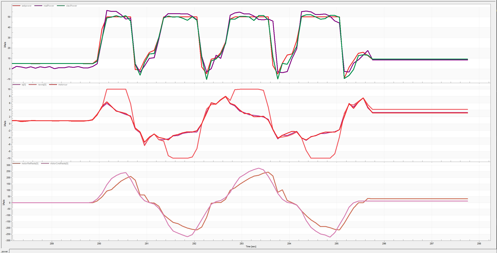

# PowerCtrl v2.0.0

## 更新
1. 函数传参变化
2. 增加RLS动态拟合参数
3. 更新日志

## 主要成员变量
```c++
PowerController抽象类里：

std::vector<float> cmdPower; // 原闭环控制器所设定的功率
float powerRatio = 1.f;      // 功率分配比例
float maxPower = 0.f;        // 允许最大输出功率
std::vector<float> setPower; // 功率控制后所得的功率
std::vector<float> setIq;    // 最终设定输出电流
CAP cap_{&HCAN1};
```
派生类里(如QuadricycleController):
```c++
MotorParam_s M3508  //3508的模型参数
RLS<3> wheelRLS_    //RLS
(如有不同型号电机需定义不同MotorParam_s和RLS)
```
## 控制逻辑
1. 更新裁判系统缓冲能量，根据电容实际能量占比与期望能量占比计算允许最大输出功率
2. 各型号电机计算各自原始功率，判断是否超功率，若超功率则按比例分配功率
3. 依照比例分配完功率后，根据各型号电机的模型参数，计算最终设定输出电流
4. RLS动态拟合，更新模型参数

## 函数
```c++
update()    //更新最大输出功率和裁判系统数据

cmdPowerCalc()    //计算模型原始功率
relPowerCalc()    //计算模型实际功率(与反馈功率比较观察模型是否拟合)
currentCalc()     //计算最终设定输出电流
(不同型号电机需分别使用不同MotorParam_s计算功率再求和，电流也分别计算)
```

## 使用
前提：kconfig中开启PowerCtrl， superCap， referee以及PowerCtrl中的rls,
     没裁判系统别开启powerCtrl setting中的refereeFeedback（比赛时一定要开启!!!!!!）

1. create PowerController 并new
```c++
hpp中
SwerveController *powerCtrl_;(使用对应控制器)
cpp中
#if APP_USE_POWERCTRL
    powerCtrl_ = new SwerveController(ChassisType_e::SWERVE);
#endif
```
2. 在底盘的update()里调用
```c++
#if APP_USE_POWERCTRL && EXTENSION_SUPERCAP
    powerCtrl_->getCap().capTask(
            chargeCmdPower, powerCtrl_->capEnable_, powerCtrl_->capCharge,
            static_cast<uint16_t>(powerCtrl_->chassisSetPower));
#endif
    调用后确保超电数据接收正常，如不正常大多是因为超电的can设置错误,数据不正常需要重烧功率板代码
```

3. ctrl
功率控制需自己计算pid，不能使用电机库封装的pid计算
```c++

    float cmd[4];
    for (uint8_t i = 0; i < 4; i++) {
        velPid_[i].elec =
                velPid_[i].pid->calc(refWSpeed._[i], wSpeed_._[i]);
        cmd[i] = velPid_[i].elec;
    }
    std::vector<float> elec;
    elec = powerCtrl_->powerCtrl(refWSpeed._, &motors_._[0], cmd, rmsg);

    for (uint8_t i = 0; i < 4; i++) {
#if APP_USE_POWERCTRL
        motors_._[i]->cmdElec(elec[i]);
#else
        motors_._[i]->cmdElec(cmd[i]);
#endif
    }

    注意：
    powerCtrl_->powerCtrl(refWSpeed._, &motors_._[0], cmd, rmsg)的四个参数
    1.refWSpeed的单位需为rads/s，如单位为rpm则传入需变单位
    2.&motors_._[0]为电机指针数组，需传入电机指针数组
    3.cmd为pid计算得到的电流，单位为电流，而不是力矩，否则会使rawPower和relPower的数据差距过大，
      导致功率控制效果变差
    4.rmsg 裁判系统msg，需手动        
    if (xQueueReceive((((MsgBus_s *)_param)->refereeQueue), &rmsg, 0) ==
            pdTRUE) {
        };   
```

## 调试
调试需在freemaster等软件中观察

1. 调底盘pid参数，实际跟随效果要好，但不能太硬
先使用正常pid输出的电流
```c++
#if APP_USE_POWERCTRL
        motors_._[i]->cmdElec(cmd[i]);
#else
        motors_._[i]->cmdElec(cmd[i]);
#endif
注：调太软会让底盘达不到功率墙

2. 功率控制
改回来
```c++
#if APP_USE_POWERCTRL
        motors_._[i]->cmdElec(elec[i]);
#else
        motors_._[i]->cmdElec(cmd[i]);
#endif
```
首先先断控,看capFeedbackPower的值,填到MotorParam_s M3508的LeakagePower中(LeakagePower为静态功耗)，
取中值即可，若想功率限制的死一点，可以填峰值(capFeedbackPower会有噪声)

如果像舵轮这种使用了两类电机时需分别断电不同品种电机,分别填入对应的LeakagePower中

在PowerController.hpp中修改limitPower为较小的值，
然后观察capFeedbackPower, chassisRawPower, chassisSetPower, chassisRelPower的曲线

成功控制效果如图, setPower为chassisSetPower, relPower为capFeedbackPower, calcPower为chassisRelPower

将此时rls的参数抄下来到（抄下来是为了场上不用花时间重新拟合）
```c++
    MotorParam_s M3508 = { .KN = 0.0001f,
                           .MLC = 0.0001f,
                           .ESR = 0.0001f,
                           .LeakagePower = 4.7f / (float)motorNum_ };

    注意刚开始M3508不能为0,即
        MotorParam_s M3508 = { .KN = 0.f,
                                .MLC = 0.f,
                                .ESR = 0.f,
                                .LeakagePower = 4.7f / (float)motorNum_ }
```

## 优化
1. 功率分配算法优化
不只使用比例分配，不同情况使用不同方法使功率分配更合理
2. 错误状态处理
如超电，裁判系统断连等错误状态处理
3. 超功率保护
超功率后主动降低限制，防止连续超功率

