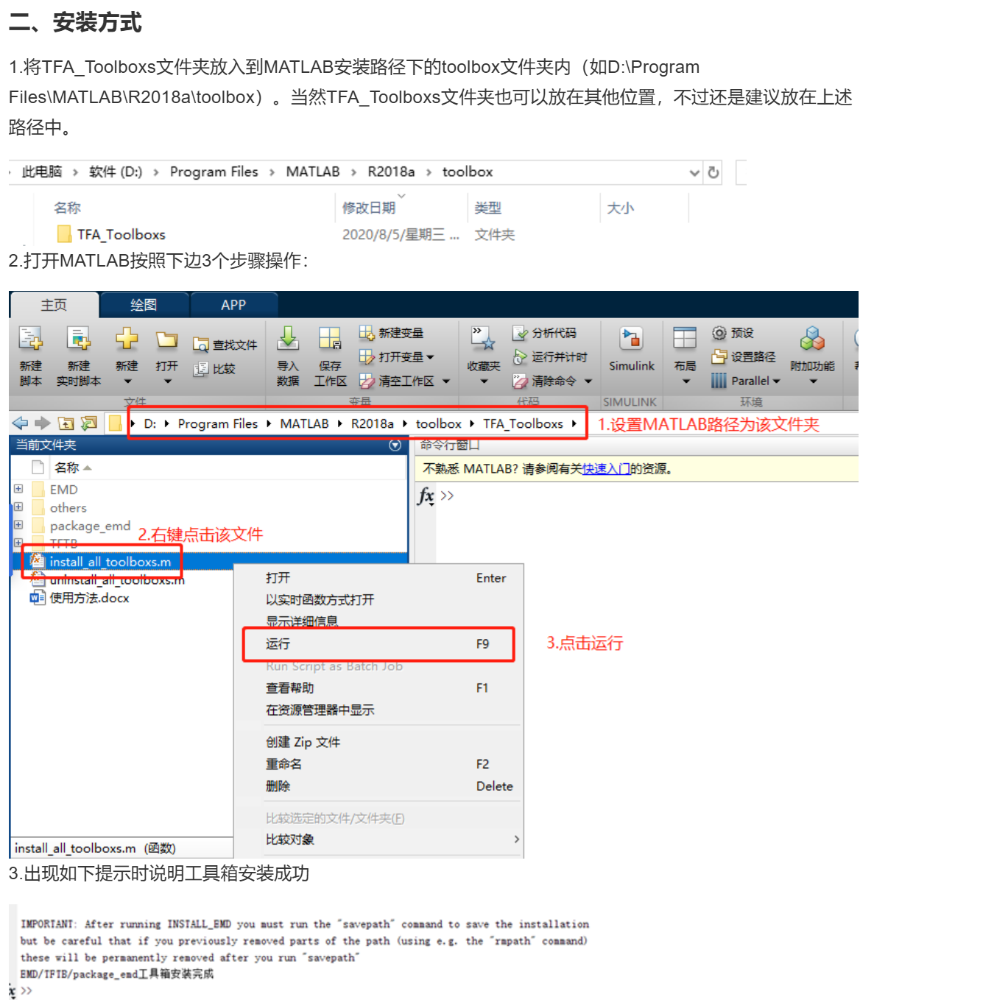

# FFT v2.1.0

## 更新
1. 增加嵌入式FFT库
2. 增加MATLAB频谱分析

## 数据打印说明
本程序中，数据打印使用封装的SEGGER_RTT_printf函数，该函数会将数据打印到RTT控制台，
因此需要使用jlink(测过dap打印速度巨慢，不过可能是我的dap问题)
```cpp
void infoLog(float _data)
{
    uint16_t len = snprintf(buffer, sizeof(buffer), "%.4f,", _data);
    LOG::Logger::instance().raw(buffer, len);
}
```
因频谱数据在一次运行中会打印多次，实测会影响电机控制，因此想要分析力矩频谱，建议直接使用infoLog(建议打印了一定数据后换行)
```cpp
SEGGER_RTT_WriteString(0, "end\n");
```

## FFT类说明
```cpp
template <uint16_t Size> class FFT
```

### 主要变量
```cpp
float timeData[Size];          //时域数据
float freqData[Size];          //频域数据
float magnitudeData[Size/2];   //频谱幅值数据
magnitudeData[Size/2] 对应的频率为 sampleRate/2， 因此频率分辨率为sampleRate/Size
即magnitudeData[0]对应0Hz，magnitudeData[1]对应sampleRate/Size Hz

uint16_t fftSize = 0;          //FFT长度  
float sampleRate = 1000.0f;    //抽样频率，即电机反馈频率

char name[16] = "NULL";        //输出信息名称
char buffer[16] = {};          //输出信息缓冲区
```

### 主要函数
```cpp
void ftProcess(float _inputData);               //实时时域数据输入
void ftProcess(const float _inputData[Size]);   //一次性输入时域数据
```

使用这个打印如下效果
>raw6020:
>时域数据（复制这个到MATLAB即可）
>1.4661,1.4661,1.3614,1.3614,1.2566,1.2566,1.0472,0.9425,0.7330,''',-7.7493,-8.2729,-8.7965,-9.4248,-9.7389,2.4086,1.8850,1.4661,1.0472,0.6283,end
>频域数据
>187.6578,4609.9805,1010.3702,864.3271,160.2888,360.3002,168.6218,''',116.2207,76.0890,77.2103,41.4678,74.9489,37.9540,0.3496,1.1538,1.1008,1.7840,0.8673,0.5090,end

## MATLAB频谱分析
### 1. 将时域数据复制到MATLAB
### 2. 进行FFT变换
这里提供三种方法观察频谱
#### MATLAB FFT变换
使用MATLAB 的FFT函数，将时域数据输入，即可得到频域数据
处理完得到频谱数据，使用plot函数绘制频谱图

#### Simulink Analysis模块
从工作区导入RawSignal和FilterSignal, 使用Simulink的Spectrum Analyzer模块进行频谱分析

#### VMD信号分解方法
根据实际情况确定所给数据的模态分解个数，随后的搜索和求解过程中可以自适应地匹配每种模态的最佳中心频率和有限带宽，
从而分解出各个频谱峰值及其对应的带宽，从而得到信号在各个频率上的分布情况。

### 特点对比
#### MATLAB FFT变换
>优点：简单，快速，直观
>缺点：频率分辨率低，分析有效信号带宽比较麻烦

#### Simulink Analysis模块
>优点：频率分辨率高
>缺点：看的眼花

#### VMD信号分解方法
>优点：非常直观区分噪声以及有效信号，分析有效信号带宽简单
>缺点：整体频谱图分布小(调整不了，因为用了封装的库)

使用VMD库需要安装工具箱


### 3. 频谱分析
>第一步: 分析出哪些是有效信号，哪些是噪声，如果是电机数据基本上都是低频有效信号
>第二步：分析有用信号的频率范围（有效信号带宽即通带）
>第三步：分析噪声的频率范围（阻带）
>第四步：有用信号与干扰之间的间隔分析，间隔越窄，对滤波器的过渡带宽度要求越高，阶数可能要更高一点
>第五步：根据噪声频率范围和有效信号频率范围，选择合适的滤波器类型和阶数，低阶滤波器带宽建议稍窄于有效信号带宽，越高阶带宽越宽点。
         阶数高延迟也会越高，带宽越窄也会延迟越高，因此需要选择合适的阶数和带宽。

## 后续优化方向
1. 增加嵌入式文件读写库，将数据保存到文件中，方便后续分析
2. 频谱分析加入有效信号分析，带宽分析等
3. VMD分解代码不再使用黑盒子，而是自己实现，方便维护


