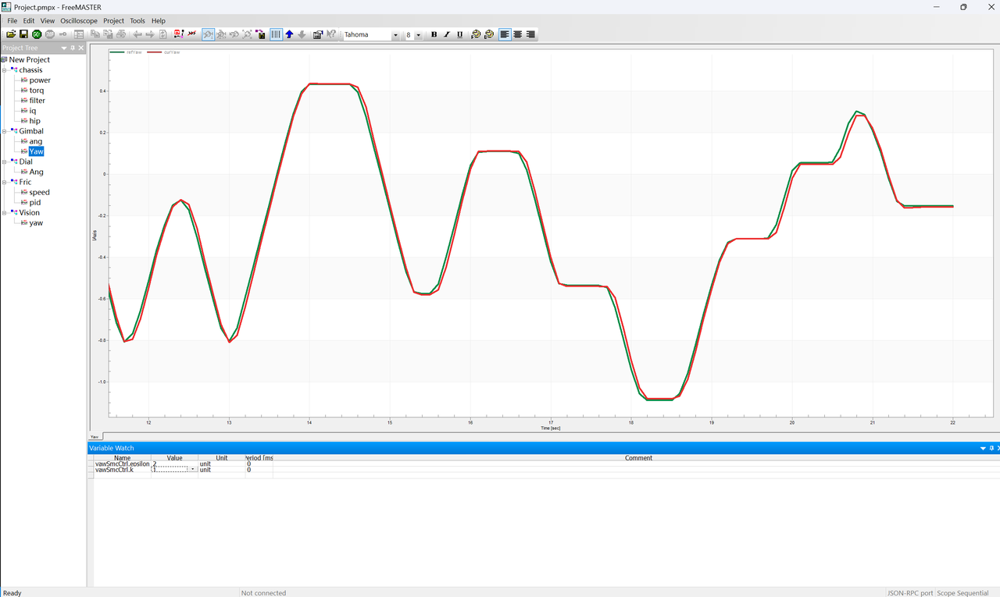

# 滑模变结构控制 v1.0

## 说明
滑动模态控制（Sliding Mode Control.SMC），又称变结构控制（Variable Structure Control.VSC），是一种特殊的非线性控制，其非线性表现为控制的不连续性，这种控制策略与其他控制的不同之处在于系统的“结构”并不固定，而是可以在动态过程中，根据系统当前的状态（如偏差及其各阶导数等），有目的地不断变化，迫使系统按照预定“滑动模态”的状态轨迹运动。

目前上车的这一版代码是用的一个非常简单的仅用位移误差去做的控制器，但意外地好用。截止至7.21，就目前调过的两辆车——26区域赛英雄和牢全来看，该控制器在大转动惯量的情况不论是在参数整定的复杂度还是控制效果都是优于小转动惯量系统的，相比于pid双环控制器，这套滑模控制器需要整定的参数非常少：①c滑模相平面斜率②epsilon滑模等速趋近参数③k指数趋近参数。但它也有明显的缺点，一旦参数整定得不好，那么就会非常非常得抖，抖震几乎是滑模控制器的一大特性，建议是在结果输出的时候加上滤波。

<figure>
    
</figure>
可以看到，在26区域赛英雄上跟得还是不错的

## 原理
<figure>
    
</figure>
简单来说，滑模控制就是人为设计一条在系统状态空间中的曲线————滑模面，通过趋近律迫使系统状态趋近于滑模面，再让系统状态沿着滑模面滑向期望点（一般为原点），从而达到控制系统的目的。

## 使用方法（供参考）
### 实例化加初始化
```cpp
// <ReachingSmc>选择需要的趋近律子类 <c>相平面斜率 <ε>等速趋近参数 <k>指数趋近参数 <α>幂次趋近参数 <dt>采样周期
static SMC::<ReachSmc> yawSmcCtrl(<c>0.1f, <ε>0.2f, <k>0.1f, <dt>1.f / 1000.f);
```

### 创建控制函数
```cpp
void Standard::yawImuSmcCtrl()
{
    float yawSmcTorq = yawSmcCtrl.smcSimplePosCalc(PINYMOTOR::getMinorArc(cmdImuYaw_, yawState_.pos));
    yaw()->cmdTorq(imuLpf[1].process(yawSmcTorq));
}
```

## 趋近律选择
### 等速趋近律
```math
\dot{s} = -\epsilon*sign(s)
```
### 指数趋近律
```math
\dot{s} = -\epsilon*sign(s) - k*s
```
### 幂次趋近律
```math
\dot{s} = -\epsilon*|s|^\alpha*sign(s)
```
### 融合趋近律
```math
\dot{s} = - \epsilon*|s|^\alpha*sign(s) - k*s
```
本趋近律融合了以上三种趋近律，是一种“取长补短”的趋近律。
如果需要等速趋近就让 k = 0、 α = 0，
如果需要指数趋近就让 α = 0，
如果需要幂次趋近就让 k = 0.

注：ε一定大于0，k、α一定大于等于0，应该不需要我写防呆设计吧？

## 参数详解
< c > : 滑模面斜率，c越大，滑模面越陡峭，滑动模态下误差收敛趋近滑模面越快；c越小，滑模面越平缓，滑动模态下误差收敛趋近滑模面越慢。

< ε > : 等速趋近参数，ε越大，模态趋近滑模面速度越快；ε越小，模态趋近滑模面速度越慢。ε趋近滑模面的速度与到滑模面的距离无关。值得注意的是，ε是导致滑模抖震的最主要原因，因此如何权衡ε的大小值得花点时间。

< k > : 指数趋近参数，k的趋近是指数级别的，模态点离滑模面越远，其趋近滑模面的速度越大；模态点离滑模面越近，其趋近滑模面的速度越小。在同一状态下，k越大，模态趋近滑模面速度越快；k越小，模态趋近滑模面速度越慢。

< α > : 幂次趋近参数，α越大，模态趋近滑模面速度越快；α越小，模态趋近滑模面速度越慢。通过调整α可保证系统状态远离滑模面时以较大的速度趋近于滑动模态；系统状态趋近滑模面时以较小的速度趋近于滑动模态，以降低抖振。其实和k差不多，只不过k是指数级，α是幂次级。当幂次趋近参数α=0时，幂次趋近律退化为指数趋近律。

< dt >: 时间分度，这没什么可讲的，就是一个采样周期，化连续为离散。

## 李雅普诺夫函数
```cpp
float lyapunovFcn() { return s * sDot; }
```
可以在调试过程中观察李雅普诺夫函数的变化情况，以判断系统是否稳定。

## 调试方法
根据自己的需要选择趋近律（一般是指数趋近），然后结合freemaster图像调整代码。先选择一组参数，太抖了就把各个参减小一点直至不抖。从这个不抖的参数慢慢往上加，如果稳态误差太大就说明等速趋近参数ε太小了，没有起到他在滑模面附近快速趋近滑模面的作用，反之ε太大，滑模面附近趋近速度太快，导致抖震。如果在较大阶跃时曲线有点跟不上就说明指数趋近参数k太小了，在加大ε加大时需要相应地减小k，防止趋近太快模态“刹不住”。